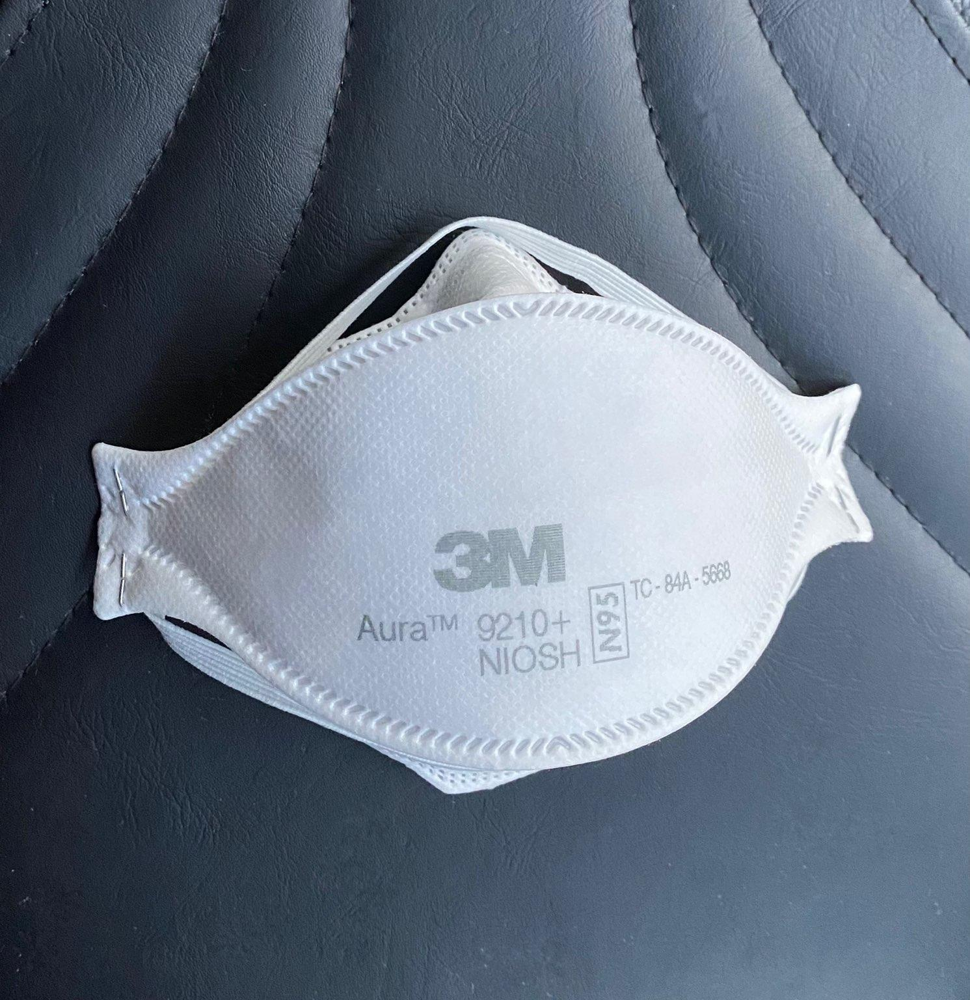

The **3M Aura** is a line of disposable N95 respirators with a unique boat-style design produced by the 3M Company.  Outside of the United States, 3M Auras are sold as FFP2 or FFP3 respirators.

3M Aura may have higher fit test pass rates than typical disposable N95 respirators; this means an individual wearing it may be more likely to have a correct fit in the absence of a formal fit test.

In [a study in untrained individuals, the 3M Aura 1862+ had a fit test pass rate of 82.5%](https://openres.ersjournals.com/content/6/4/00581-2020), whereas the typical N95 cup-style respirators had pass rates of 73%, 67%, and 23% (and the KN95 had a pass rate of 0%). In [a small study of 60 anaesthetists](https://asapublicaccess.s3-ap-southeast-2.amazonaws.com/AustralianAnaesthetist/Feature_Fittesting.pdf), the 3M Aura 1870+ had a 5/5 (100%) pass rate, compared to a pass rate of 3/7 (43%) for the 3M 8210 (typical N95 cup style) and a pass rate of 1/9 (11%) for other typical N95 respirators.

 (public domain).](media/white-house-2021-4-19-3m-aura.jpg)

In the United States, 3M appears to manufacture the following models of the Aura (as of 2021-8):

-   [3M Aura 9205+](https://www.3m.com/3M/en_US/p/d/v101146024/)
-   [3M Aura 9211+](https://www.3m.co.id/3M/en_ID/p/d/v000125629/) (exhalation valve model)
-   [3M Aura 9210+](https://www.3m.co.id/3M/en_ID/p/d/v000125628/)
-   [3M Aura 1870](https://www.3m.co.id/3M/en_ID/p/d/v000057785/) (FDA cleared for surgical mask use)
-   [3M Aura 1870+](https://www.3m.co.id/3M/en_ID/p/d/v000125630/) (FDA cleared for surgical mask use)

Discontinued 3M Aura models (incomplete list):

-   [3M Aura 9210, discontinued "effective October 1, 2014."](https://www.3m.com/3M/en_US/p/d/v000057772/)
-   [3M Aura 9211](https://www.3m.com/3M/en_US/p/d/v000585713/1/)

According to a trademark filing, the first use in commerce of "Aura" by 3M was in January of 2012, so that may be when the Aura line was first released (USPTO trademark serial \# 85240142).

## Counterfeits

Due to widespread demand from the COVID-19 pandemic and popularity of the respirator series, the 3M Auras have been frequently counterfeit. On July 14th 2021, [3M issued a counterfeit alert, noting that millions of counterfeit 3M Auras had been seized](https://multimedia.3m.com/mws/media/1934748O/3m-counterfeit-communication-letter.pdf); in this case, the 3M Aura 1870+.

-   ["Millions of Counterfeit N95 Masks Were Bought in 5 States, U.S. Says"](https://www.nytimes.com/2021/02/10/us/n95-mask-fraud-investigation.html) - New York Times article, 2021-2-10. Article notes the fakes looked like good counterfeits.
-   ["WSHA: Hundreds of thousands of counterfeit N95 masks purchased by Washington hospitals"](https://komonews.com/news/local/wsha-hundreds-of-thousands-of-counterfeit-n95-masks-purchased-by-washington-hospitals?fbclid=IwAR1iAu3gOzDR-CUfHX-n1ciZLLAawbSysq61zAR-t2nNeH8wnxArzCrJkdg) - 2021-2-7 news article.

The counterfeit 3M Auras often look nearly indistinguishable from the legitimate 3M products but fail to provide the protection of the genuine product. Aaron Collins, an individual with a background in aerosol science, [performed a home quantitative fit test on a counterfeit 3M 1870+ and found it had a filtration efficiency of 94% on his test aerosol](https://docs.google.com/spreadsheets/d/1M0mdNLpTWEGcluK6hh5LjjcFixwmOG853Ff45d3O-L0/edit#gid=1976839763). In comparison, when he tested a (more likely) genuine 1870+ he found a filtration efficacy of 99.3%.
